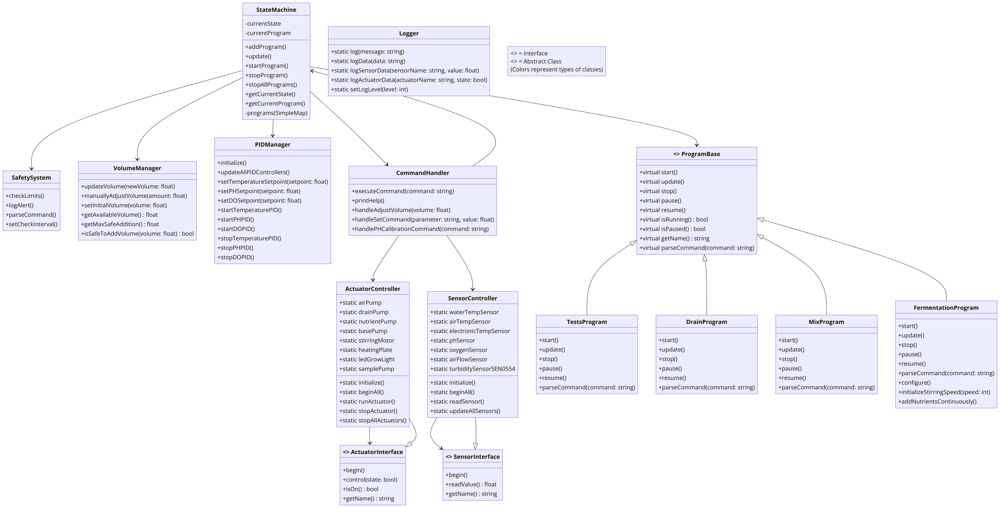

## System Architecture Diagram

The following diagram illustrates the overall architecture of the bioreactor control system implemented on Arduino, showing the relationships between different components:



*Figure 1: Detailed class diagram of the Arduino-based bioreactor control system, showing major components and their interactions.*

This diagram provides a comprehensive view of the system's structure, including:
- The central role of the StateMachine in coordinating various programs and components
- The relationship between sensors and actuators through their respective controllers and interfaces
- The integration of safety, volume management, and PID control systems
- The hierarchy of different programs derived from the ProgramBase class

Key components:
1. **StateMachine**: Manages the overall state of the bioreactor and coordinates program execution.
2. **SensorController** and **ActuatorController**: Manage various sensors and actuators through standardized interfaces.
3. **PIDManager**: Implements PID control for temperature, pH, and dissolved oxygen.
4. **VolumeManager**: Tracks and manages liquid volume in the bioreactor.
5. **SafetySystem**: Monitors critical parameters and triggers alerts or emergency stops.
6. **Logger**: Handles system-wide logging for debugging and data collection.
7. **CommandHandler**: Processes user commands and interacts with other system components.

The color coding and interface notations help distinguish between different types of classes and their roles within the system. This architecture allows for modular development, easy extension of functionality, and clear separation of concerns in the bioreactor control system.

## Programming Strategies

### Object-Oriented Design
The system employs object-oriented programming principles to create a modular and extensible architecture. This approach allows for easy maintenance and future enhancements.

### Use of Interfaces
Interfaces are extensively used to promote loose coupling and enable polymorphism:

- `SensorInterface`: Standardizes methods for all sensors (`begin()`, `readValue()`).
- `ActuatorInterface`: Provides a common interface for all actuators (`begin()`, `control()`, `isOn()`).
- `ProgramBase`: Defines a common structure for all bioreactor programs (`start()`, `update()`, `stop()`, `pause()`, `resume()`).

This strategy allows for easy addition of new sensors or actuators without modifying existing code.

### Arduino-Specific Considerations
The code is optimized for the Arduino environment:

- Use of `millis()` for non-blocking timing operations.
- Direct port manipulation for faster I/O operations where necessary.
- Efficient memory management, considering Arduino's limited resources.

### State Machine Implementation
The `StateMachine` class is central to the system's operation:

1. **States**: Implements different states (IDLE, RUNNING, PAUSED, COMPLETED, STOPPED, ERROR).
2. **Programs**: Manages various bioreactor programs (e.g., mixing, draining, fermentation).
3. **Transitions**: Handles transitions between states based on program execution and user commands.

Key methods:
- `addProgram()`: Registers a new program with the state machine.
- `startProgram()`: Initiates a specific program.
- `update()`: Called in the main loop to progress the current program.
- `stopProgram()`: Halts the current program.

The state machine ensures that only one program runs at a time and manages the overall flow of the bioreactor's operation.

## Sensor and Actuator Management

### Sensors
The system supports various sensors:
- Temperature (PT100, DS18B20)
- pH
- Dissolved Oxygen
- Turbidity
- Air Flow

Each sensor type has its own class implementing the `SensorInterface`. The `SensorController` manages all sensors centrally.

### Actuators
The system controls several actuators:
- Pumps (Air, Drain, Nutrient, Base)
- Stirring Motor
- Heating Plate
- LED Grow Light

Each actuator type has its own class implementing the `ActuatorInterface`. The `ActuatorController` provides centralized control over all actuators.

## Safety and Volume Management

### Safety System
The `SafetySystem` continuously monitors critical parameters:
- Checks temperature, pH, dissolved oxygen, and volume limits.
- Triggers warnings or emergency stops when limits are exceeded.
- Allows for dynamic adjustment of safety thresholds.

### Volume Management
The `VolumeManager` keeps track of the liquid volume in the bioreactor:
- Updates volume based on additions (nutrients, base) and removals (sampling, draining).
- Ensures safe volume levels to prevent overflow or dry running.
- Provides methods for manual volume adjustments and initial volume setting.

## PID Control
The `PIDManager` implements PID (Proportional-Integral-Derivative) control for key parameters:
- Temperature control
- pH control
- Dissolved Oxygen control

It allows for:
- Starting and stopping individual PID controllers.
- Updating PID parameters dynamically.
- Automatic adjustment of actuators based on PID outputs.

## Logging and Communication
The `Logger` class provides comprehensive logging capabilities:
- Different log levels (DEBUG, INFO, WARNING, ERROR).
- Logging of sensor data, actuator states, and system events.
- Supports output to serial for debugging and data collection.

Communication with external systems (e.g., ESP32) is handled through serial interfaces, allowing for remote monitoring and control.

## Specific Programs

The bioreactor system includes several predefined programs, each inheriting from the `ProgramBase` class:

### 1. TestsProgram
- Purpose: Runs various tests on sensors and actuators.
- Key features:
  - Individual actuator testing
  - All actuators sequential testing
  - Continuous sensor reading
  - PID control testing for temperature, pH, and dissolved oxygen

### 2. DrainProgram
- Purpose: Controls the draining process of the bioreactor.
- Key features:
  - Controlled draining at specified rate
  - Duration-based operation
  - Safe stop and pause functionalities

### 3. MixProgram
- Purpose: Manages the mixing operation in the bioreactor.
- Key features:
  - Control over stirring motor speed
  - Continuous operation with pause/resume capabilities

### 4. FermentationProgram
- Purpose: Executes the main fermentation process.
- Key features:
  - Temperature, pH, and dissolved oxygen control
  - Nutrient and base addition management
  - Volume tracking and safety checks
  - Data logging for experiment analysis

## Error Handling and Robustness

The system incorporates several strategies to enhance operational robustness:

### 1. Error Logging
- Errors are logged using the `Logger` class with different severity levels (DEBUG, INFO, WARNING, ERROR).
- This allows for tracking and diagnosis of issues during operation.

### 2. Safety System
- The `SafetySystem` class continuously monitors critical parameters.
- It can trigger warnings or emergency stops when limits are exceeded.

### 3. Sensor Reading Verification
- The `SensorController` provides methods to read sensor values.
- Invalid readings can be detected and logged, although extensive error checking is not implemented for all sensors.

### 4. Actuator Control Safeguards
- The `ActuatorController` manages all actuators and provides methods to stop individual or all actuators.
- This allows for quick shutdown in case of emergencies or errors.

Note: While the system has some error handling capabilities, it does not implement comprehensive exception handling with try-catch blocks or a watchdog timer as originally stated. These could be potential areas for future enhancement to increase system robustness.

## Main Loop Structure

The `loop()` function in the Arduino sketch serves as the main execution loop:

1. **Command Processing**
   - Checks for incoming commands from serial communication.
   - Parses and executes commands using the `CommandHandler`.

2. **State Machine Update**
   - Calls `stateMachine.update()` to progress the current program.

3. **PID Control Update**
   - Updates all active PID controllers.

4. **Safety Checks**
   - Periodically runs safety system checks.

5. **Data Logging**
   - Logs sensor data and system state at regular intervals.

6. **Delay**
   - A short delay to prevent excessive CPU usage.

## Setup and Initialization

The `setup()` function initializes the system:

1. Serial communication setup.
2. Sensor initialization.
3. Actuator initialization.
4. Safety system setup.
5. Program registration with the state machine.
6. PID manager initialization.

## Configuration and Calibration

The system allows for various configuration and calibration procedures:

### Sensor Calibration
- pH sensor calibration routine.
- Dissolved oxygen sensor calibration.
- Temperature sensor offset adjustments.

### PID Tuning
- Methods to adjust PID parameters for each controlled variable.
- Auto-tuning capabilities for optimal PID performance.

### Safety Threshold Configuration
- Dynamic setting of safety limits for temperature, pH, volume, etc.

## Conclusion

This bioreactor control system provides a comprehensive solution for managing complex fermentation processes. Its modular design, robust error handling, and flexible program structure make it suitable for a wide range of biotechnology applications. The system's ability to precisely control environmental parameters while ensuring safety and data logging capabilities makes it a valuable tool for both research and industrial fermentation processes.


## Advanced Programming Techniques and Design Principles

### Instantiation and Centralized Interfaces

Le système utilise une approche centralisée pour la gestion des capteurs et des actionneurs :

- `SensorController` et `ActuatorController` servent de points centraux pour interagir avec tous les capteurs et actionneurs.
- Ces contrôleurs utilisent des méthodes statiques et des pointeurs pour gérer les instances, évitant ainsi le besoin de variables globales.

Exemple de `SensorController` :
```cpp
class SensorController {
public:
    static void initialize(PT100Sensor& waterTemp, DS18B20TemperatureSensor& airTemp, ...);
    static float readSensor(const String& sensorName);
    // ...
private:
    static PT100Sensor* waterTempSensor;
    static DS18B20TemperatureSensor* airTempSensor;
    // ...
};
```

### Use of Templates and Advanced C++ Features

Le code évite généralement les modèles complexes, préférant des implémentations plus simples et directes. Cependant, un modèle simple est utilisé dans la classe `SimpleMap` pour un stockage flexible de paires clé-valeur :

```cpp
template<typename K, typename V, int MaxSize>
class SimpleMap {
    // ...
};
```

`static_cast` est utilisé avec parcimonie, principalement dans le `PIDManager` pour des conversions de types.

### Software Architecture and Design Principles

- **Static Methods** :
  - Utilisées de manière extensive dans les classes contrôleurs (`SensorController`, `ActuatorController`) pour une gestion centralisée.
  - Fournissent un point d'accès global sans utiliser de variables globales.

- **Singleton-like Pattern** :
  - Bien que n'étant pas de véritables singletons, des classes comme `Logger` et `SafetySystem` sont conçues pour n'avoir qu'une seule instance.

- **Interface Segregation** :
  - `SensorInterface` et `ActuatorInterface` offrent des interfaces claires et distinctes pour différents types de dispositifs.

- **Dependency Inversion** :
  - Les modules de haut niveau (comme `StateMachine`) dépendent des abstractions (`ProgramBase`) plutôt que des implémentations concrètes.

- **Composition over Inheritance** :
  - Le système favorise la composition (par exemple, `StateMachine` composé avec divers programmes) plutôt que des hiérarchies d'héritage profondes.

### Inconsistencies and Potential Improvements

- **Error Handling** :
  - La gestion des erreurs n'est pas cohérente dans tout le système. Certaines parties utilisent le `Logger` pour les erreurs, tandis que d'autres ne gèrent pas explicitement les erreurs.
  - Il n'y a pas d'utilisation systématique des exceptions ou des codes d'erreur.

- **Memory Management** :
  - L'utilisation de pointeurs bruts (par exemple, dans `SensorController` et `ActuatorController`) sans sémantique de propriété claire pourrait entraîner des fuites de mémoire ou des pointeurs pendants.

- **Const Correctness** :
  - Toutes les méthodes qui ne modifient pas l'état de l'objet ne sont pas marquées comme `const`, ce qui pourrait entraîner des modifications non intentionnelles.

- **Naming Conventions** :
  - Il y a une certaine incohérence dans les conventions de nommage, en particulier avec les variables membres privées (certaines utilisent un préfixe souligné, d'autres non).

- **Code Duplication** :
  - Il y a une certaine duplication dans le code lié au PID qui pourrait être refactorisée pour une meilleure maintenabilité.

- **Testing** :
  - Bien qu'il existe un `TestsProgram`, il n'est pas clair s'il existe des tests unitaires pour les composants individuels.

- **Configuration Management** :
  - Des valeurs codées en dur sont éparpillées dans le code. Un système de configuration centralisé pourrait améliorer la flexibilité.

- **Sensor and Actuator Polymorphism** :
  - Bien que des interfaces soient utilisées, le système ne tire pas pleinement parti du polymorphisme, en particulier dans les classes contrôleurs.

- **State Machine Implementation** :
  - La machine à états pourrait être plus robuste avec une implémentation plus formelle des transitions d'états et des gardes.

- **Thread Safety** :
  - Si ce code doit être utilisé dans un environnement multi-thread (par exemple, avec un RTOS), il n'y a pas de considération claire pour la sécurité des threads.

Aborder ces points pourrait améliorer de manière significative la robustesse, la maintenabilité et l'extensibilité du système.
